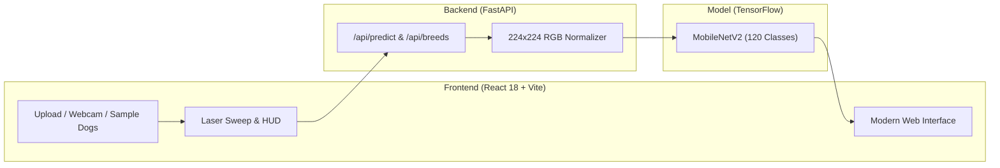

# 🐕 Dog Breed Classification

<p align="center">
  
  
  
  
  
  
</p>

<p align="center">
  <b>A deep learning web application to classify 120 dog breeds in real time using MobileNetV2 transfer learning, interactive visual scanner, and breed intelligence details.</b>
</p>

<p align="center">
  <a href="https://your-live-demo.vercel.app">
    
  </a>
</p>

---

## 🌟 Key Highlights

- **⚡ Visual Laser Scanner**: Real-time laser sweep animation and target HUD reticles while processing images.
- **🐕 120 Dog Breeds**: MobileNetV2 architecture trained on the Stanford Dogs dataset covering 120 breeds.
- **📊 Detailed Breed Dossiers**: Displays origin, AKC category, life expectancy, documented temperaments, and interactive trait meters (Energy, Trainability).
- **📷 Flexible Inputs**: Drag-and-drop file upload, live webcam capture, and 1-click test dogs (Husky, Golden Retriever, German Shepherd, Pug, French Bulldog).
- **🌐 100% Free Cloud Deployment**: Ready for 1-click deployment on **Hugging Face Spaces** (Backend) and **Vercel** (Frontend).

---

## 🏗️ Architecture



---

## 🔬 Model Specifications

| Property | Details |
| :--- | :--- |
| **Model** | MobileNetV2 (`mobilenet_v2_130_224`) Transfer Learning |
| **Input Shape** | `(1, 224, 224, 3)` normalized to $[0, 1]$ |
| **Total Classes** | 120 Dog Breeds |
| **Model File** | `models/20261009-*.h5` (~23.4 MB) |
| **Dataset** | Stanford Dogs Dataset / Kaggle Dog Breed Identification |

---

## 📁 Repository Structure

```text
├── backend/
│   ├── main.py              # FastAPI server with prediction routes
│   ├── inference.py         # Image preprocessing, model loading & top-5 ranking
│   ├── breeds.json          # 120 dog breed class labels
│   ├── breed_info.json      # Breed traits, temperaments & origins
│   ├── requirements.txt     # Python dependencies
│   └── Dockerfile           # Docker configuration for deployment
├── frontend/
│   ├── src/
│   │   ├── App.jsx          # Clean React interface & scanner
│   │   ├── style.css        # Responsive dark theme & animations
│   │   ├── audio.js         # Sound effects
│   │   └── main.jsx         # Entry point
│   ├── index.html           # HTML template
│   └── vercel.json          # Vercel deployment configuration
├── models/
│   └── *.h5                 # Trained model weights (23.4 MB)
├── dataset/                 # Evaluation images
├── start_dev.bat            # 1-Click Windows development launcher
├── .gitignore               # Clean git exclusion rules
└── README.md                # Project documentation
```

---

## 🚀 Quickstart (Local Run)

### 1-Click Launch (Windows)
Double-click `start_dev.bat` in the root folder. Both backend and frontend will start automatically.

### Manual Launch

**1. Start Backend:**
```bash
python -m uvicorn backend.main:app --host 0.0.0.0 --port 8000 --reload
```
*API documentation available at `http://localhost:8000/docs`*

**2. Start Frontend:**
```bash
cd frontend
npm run dev
```
*UI available at `http://localhost:5173`*

---

## ☁️ Deployment Guide

### 1. Backend (Hugging Face Spaces)
1. Create a **New Space** on Hugging Face with SDK: **Docker**.
2. Push or upload the `backend/` folder and `models/` folder.
3. Hugging Face builds the Docker container and provides a free public URL.

### 2. Frontend (Vercel)
1. Import your GitHub repository into Vercel.
2. Set **Root Directory** to `frontend`.
3. Add environment variable `VITE_API_URL` set to your backend URL.
4. Click **Deploy**.

---

## 📄 License
MIT License
