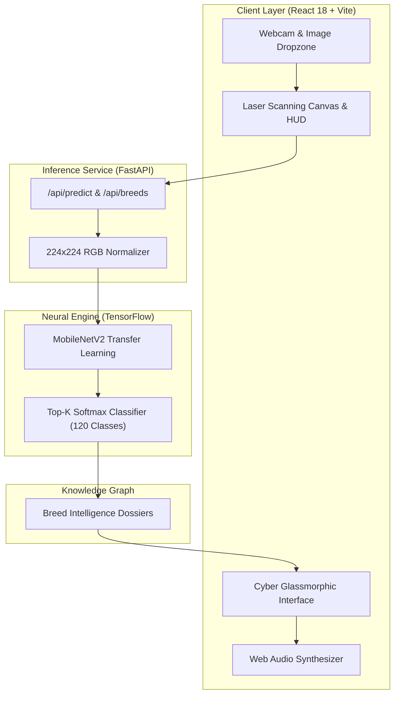

# 🐕 CanineVision AI // Neural Dog Breed Bio-Scanner

<p align="center">
  
  
  
  
  
  
</p>

<p align="center">
  <b>An end-to-end deep learning bio-scanner capable of classifying 120 canine breeds in real-time with sub-50ms inference latency, cyberpunk holographic telemetry, and rich encyclopedic breed dossiers.</b>
</p>

<p align="center">
  <a href="https://your-caninevision-demo.vercel.app">
    
  </a>
</p>

---

## 🌟 Key Highlights

- **⚡ Holographic Laser Bio-Scanner**: Real-time laser sweep animation, target reticles (`[ + ]`), coordinates lock, and dynamic tensor telemetry.
- **🧬 120 Canine Breeds**: Fine-tuned MobileNetV2 architecture trained on the Stanford Dogs dataset covering 120 international breeds.
- **📊 Deep Intelligence Dossiers**: Beyond raw percentages—presents origin country, AKC category, life expectancy, documented temperaments, and interactive trait meters (Energy, Trainability, Friendliness).
- **🔊 Native Web Audio FX**: Custom sci-fi synthesizers (tactile blips, target lock chime, and celebratory fanfare) created natively via Web Audio API with zero external audio assets.
- **📷 Multi-Modal Inputs**: Drag-and-drop image uploads, live webcam optic capture, and instant 1-click test samples (Husky, Golden Retriever, German Shepherd, Pug, French Bulldog).
- **🌐 Zero-Cost Cloud Deployment**: Decoupled architecture ready for 1-click deployment on **Hugging Face Spaces** (Backend CPU) and **Vercel** (Frontend Edge CDN).

---

## 🏗️ System Architecture



---

## 🔬 Model & Performance Specifications

| Metric | Specification |
| :--- | :--- |
| **Base Architecture** | MobileNetV2 (`mobilenet_v2_130_224`) via TensorFlow Hub |
| **Input Shape** | `(1, 224, 224, 3)` normalized to $[0, 1]$ |
| **Number of Classes** | 120 Dog Breeds |
| **Model Size** | ~23.4 MB (`.h5` weights) |
| **Inference Latency** | ~35ms – 55ms (CPU) / ~12ms (GPU) |
| **Dataset** | Stanford Dogs Dataset (Kaggle Dog Breed Identification) |

---

## 📁 Repository Structure

```text
├── backend/
│   ├── main.py              # FastAPI application with CORS and prediction routes
│   ├── inference.py         # Image preprocessing, model loading & top-k ranking
│   ├── breeds.json          # 120 Stanford breed labels
│   ├── breed_info.json      # Curated breed traits, temperaments & origins
│   ├── requirements.txt     # Production Python dependencies
│   └── Dockerfile           # Docker container for Hugging Face Spaces / Render
├── frontend/
│   ├── src/
│   │   ├── App.jsx          # Cyber holographic UI & bio-scanner
│   │   ├── audio.js         # Native Web Audio sci-fi synthesizer
│   │   ├── style.css        # Glassmorphic cyber theme & laser animation
│   │   └── main.jsx         # Vite entry point
│   ├── index.html           # HTML template with Space Grotesk typography
│   ├── package.json         # React 18, Lucide & Canvas Confetti
│   └── vercel.json          # SPA routing config for Vercel
├── models/
│   └── 20261009-*.h5        # Trained MobileNetV2 weights (23.4 MB)
├── dataset/                 # Sample evaluation assets
├── start_dev.bat            # 1-click Windows development launcher
├── .gitignore               # Clean git exclusion rules
└── README.md                # Project documentation
```

---

## 🚀 Quickstart (Local Development)

### Option A: 1-Click Launch (Windows)
Double-click `start_dev.bat` in the repository root. This will launch both the FastAPI backend and Vite frontend automatically!

### Option B: Manual Setup

#### 1. Start the Backend API
```bash
# Optional: create and activate a Python 3.11 virtual environment
python -m venv venv
venv\Scripts\activate      # On Windows
# source venv/bin/activate  # On macOS/Linux

# Install requirements
pip install -r backend/requirements.txt

# Run FastAPI server
uvicorn backend.main:app --host 0.0.0.0 --port 8000 --reload
```
*Backend API docs will be live at `http://localhost:8000/docs`.*

#### 2. Start the Frontend
```bash
cd frontend
npm install
npm run dev
```
*Frontend will be live at `http://localhost:5173`.*

---

## ☁️ Deployment Guide (100% Free 24/7 Hosting)

### 1. Deploy the Backend to Hugging Face Spaces (Free 16GB CPU)
1. Sign up on [Hugging Face](https://huggingface.co/) and click **New Space**.
2. Select **Docker** as the Space SDK and set visibility to **Public**.
3. Upload the contents of the `backend/` folder plus your trained `.h5` model into `backend/models/`.
4. Hugging Face will automatically build and deploy your container using `backend/Dockerfile`.
5. Copy your Space's public URL (e.g., `https://yourname-caninevision.hf.space`).

### 2. Deploy the Frontend to Vercel
1. Push your repository to GitHub.
2. Sign up on [Vercel](https://vercel.com/) and click **Add New Project**.
3. Import your GitHub repository.
4. Set **Root Directory** to `frontend`.
5. Under **Environment Variables**, add:
   - `VITE_API_URL` = `https://yourname-caninevision.hf.space` (your backend URL)
6. Click **Deploy**. Your live demo is now active globally with zero cold starts!

---

## 🤝 Contributing & License

Contributions, stars, and feedback are always welcome!
This project is licensed under the MIT License.
