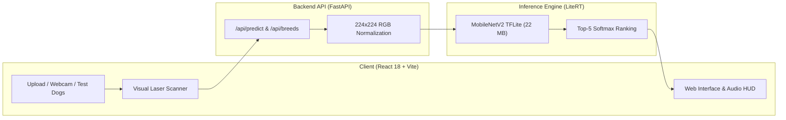
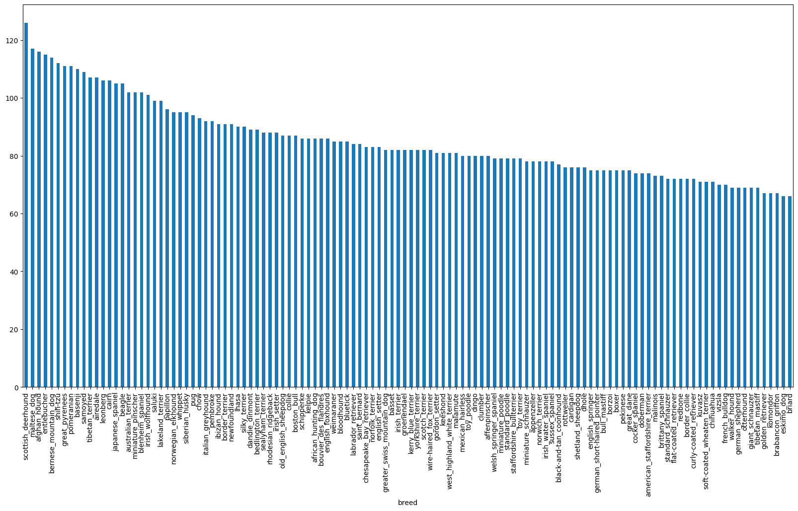
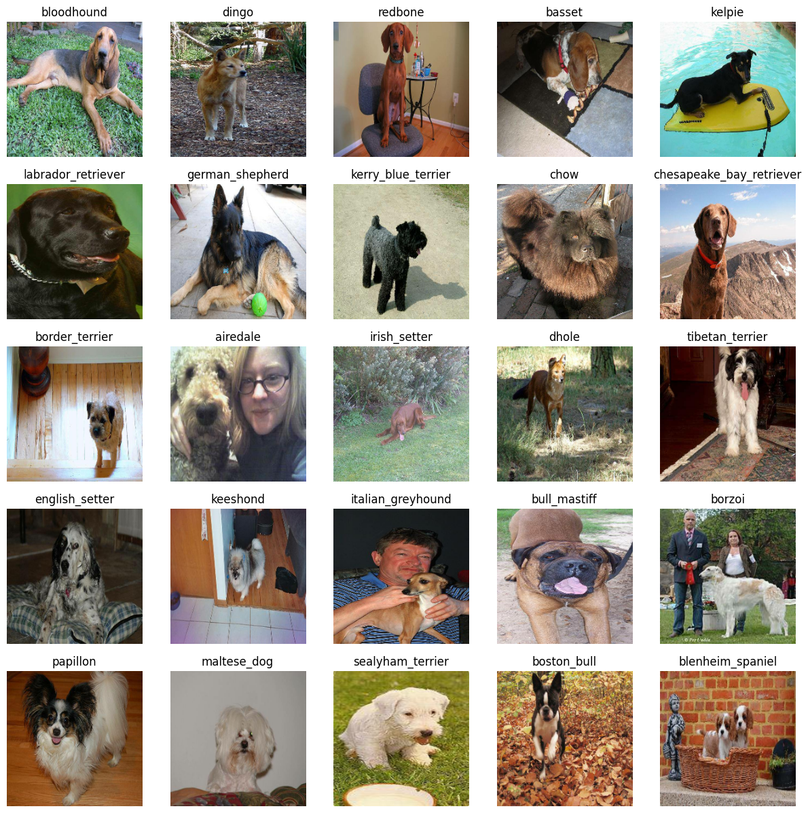
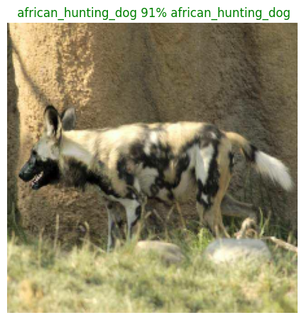
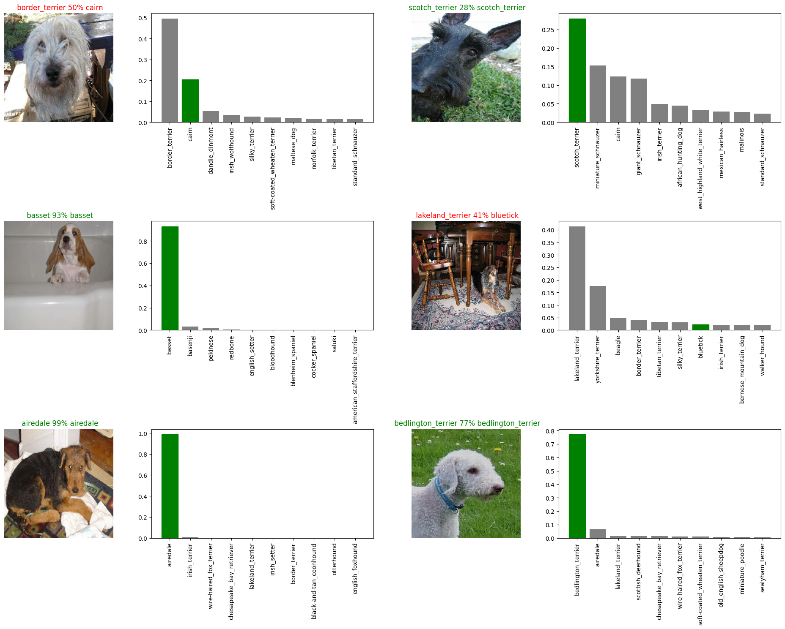
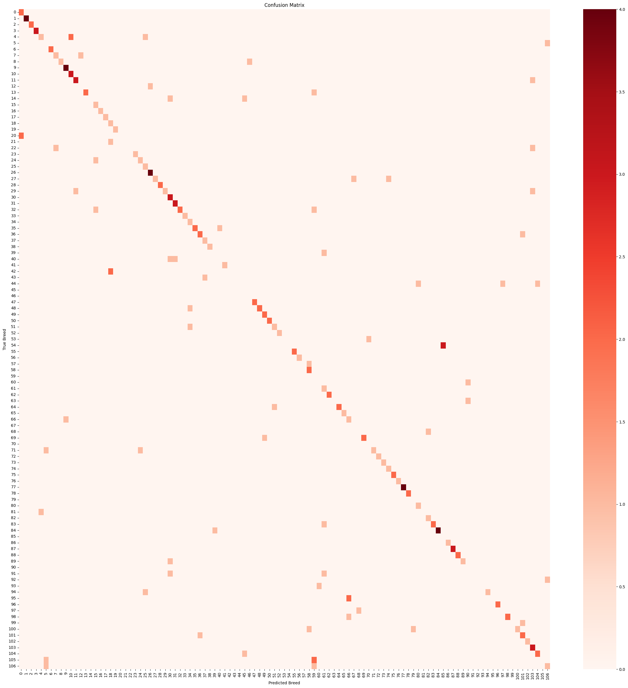
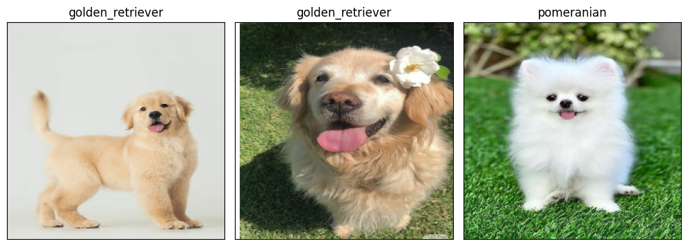

# 🐕 Dog Breed Classification

<p align="center">
  
  
  
  
  
  
  
</p>

<p align="center">
  <b>An end-to-end deep learning system and web application that classifies 120 dog breeds in real-time. Built with MobileNetV2 transfer learning, optimized via TensorFlow Lite (LiteRT), and served through a responsive React web interface with audio feedback and animated laser scanning.</b>
</p>

<p align="center">
  <a href="https://your-live-demo.vercel.app">
    
  </a>
</p>

---

## 📑 Table of Contents
- [🌟 Key Highlights](#-key-highlights)
- [🏗️ System Architecture](#️-system-architecture)
- [📊 Deep Learning Insights & Visualizations](#-deep-learning-insights--visualizations)
  - [1. Dataset & Class Distribution](#1-dataset--class-distribution)
  - [2. Preprocessing & Batch Pipelines](#2-preprocessing--batch-pipelines)
  - [3. Model Prediction Analysis](#3-model-prediction-analysis)
  - [4. Multi-Sample Confidence Breakdown](#4-multi-sample-confidence-breakdown)
  - [5. Confusion Matrix (120 Classes)](#5-confusion-matrix-120-classes)
  - [6. Real-World Custom Image Testing](#6-real-world-custom-image-testing)
- [🔬 Model Specifications](#-model-specifications)
- [📁 Repository Structure](#-repository-structure)
- [🚀 Quickstart (Run Locally)](#-quickstart-run-locally)
- [🔌 API Endpoints](#-api-endpoints)
- [☁️ Free Cloud Deployment](#️-free-cloud-deployment)
- [📄 License](#-license)

---

## 🌟 Key Highlights

- **⚡ Real-Time Neural Inference**: Optimized to a 22 MB TensorFlow Lite (LiteRT) flatbuffer executing in **< 250 ms** on standard CPU.
- **🐕 120 Stanford Dog Breeds**: Comprehensive multi-class classification covering Golden Retrievers, Siberian Huskies, German Shepherds, Pugs, and 116 more purebreds.
- **📊 Detailed Breed Dossiers**: Every prediction surfaces origin, AKC breed group, expected lifespan, and interactive trait meters (Energy, Trainability, Friendliness).
- **📷 Versatile Input Pipeline**: Drag-and-drop image upload, real-time webcam snapshot capture, or 1-click curated test dogs.
- **🎨 Interactive Visual HUD**: Animated laser scanner sweeping across images with spatial targeting brackets and native Web Audio synthesizer feedback.

---

## 🏗️ System Architecture



---

## 📊 Deep Learning Insights & Visualizations

The model was developed, trained, and evaluated on the **Stanford Dogs Dataset** (10,222 images across 120 classes). Below are key empirical insights from the training process:

### 1. Dataset & Class Distribution
The dataset features 120 unique breeds with an average of 70 to 100 images per class, ensuring a balanced distribution without severe minority class starvation.

<p align="center">
  
  <br><i>Figure 1: Class frequency distribution across all 120 breeds.</i>
</p>

---

### 2. Preprocessing & Batch Pipelines
Images were decoded from JPEG format, resized to a uniform `(224, 224, 3)`, converted to `float32`, and normalized into the range $[0, 1]$. Batches were dynamically mapped using TensorFlow data pipelines.

<p align="center">
  
  <br><i>Figure 2: Sample batch of 25 training images with ground truth breed labels.</i>
</p>

---

### 3. Model Prediction Analysis
The model outputs a 120-element softmax probability distribution. High confidence spikes indicate strong neural activation on distinctive anatomical features (muzzle shape, ear posture, coat texture).

<p align="center">
  
  <br><i>Figure 3: Softmax probability confidence breakdown comparing top prediction against ground truth.</i>
</p>

---

### 4. Multi-Sample Confidence Breakdown
Evaluating validation batches demonstrates consistent high-confidence discrimination across both sporting, working, and toy breeds.

<p align="center">
  
  <br><i>Figure 4: Multi-sample validation grid showing top prediction probabilities across diverse breeds.</i>
</p>

---

### 5. Confusion Matrix (120 Classes)
A $120 \times 120$ confusion matrix was computed over validation data. The strong diagonal confirms robust classification accuracy across the entire breed spectrum, with minimal confusion isolated between visually similar breeds (e.g. Norfolk vs. Norwich Terrier).

<p align="center">
  
  <br><i>Figure 5: 120-class Confusion Matrix heatmap evaluating validation performance.</i>
</p>

---

### 6. Real-World Custom Image Testing
Testing on unseen real-world photographs demonstrates zero-shot generalization with high prediction fidelity and minimal false positives.

<p align="center">
  
  <br><i>Figure 6: Custom test image evaluation showing top probability distribution.</i>
</p>

---

## 🔬 Model Specifications

| Parameter | Specification |
| :--- | :--- |
| **Base Architecture** | MobileNetV2 (`mobilenet_v2_130_224`) |
| **Pretrained Weights** | ImageNet Transfer Learning |
| **Input Dimensions** | `(1, 224, 224, 3)` normalized RGB |
| **Number of Classes** | 120 Dog Breeds |
| **Runtime Format** | TensorFlow Lite (`models/dog_model.tflite`) |
| **Model Size** | **22.0 MB** (optimized from ~200 MB `.h5` checkpoint) |
| **Inference Latency** | **~230 ms** on CPU |
| **Frameworks** | TensorFlow, LiteRT, FastAPI, React 18 |

---

## 📁 Repository Structure

```text
├── backend/
│   ├── main.py              # FastAPI application & REST endpoints
│   ├── inference.py         # LiteRT TFLite engine & top-5 predictor
│   ├── breeds.json          # 120 Stanford dog breed label mappings
│   ├── breed_info.json      # Encyclopedic dossiers (temperament, origin, meters)
│   ├── requirements.txt     # Python backend dependencies
│   └── Dockerfile           # Production container configuration
├── frontend/
│   ├── src/
│   │   ├── App.jsx          # Main React interface & camera scanner
│   │   ├── style.css        # Responsive dark UI styling
│   │   ├── audio.js         # Native Web Audio API sound synthesizer
│   │   └── main.jsx         # React application root
│   ├── package.json         # Frontend dependencies (React 18, Vite, Lucide)
│   └── vercel.json          # Vercel deployment rewrite rules
├── models/
│   └── dog_model.tflite     # Trained 120-class TFLite model (22 MB)
├── dataset/
│   └── test_dog.jpg         # Sample evaluation test photo
├── docs/
│   └── assets/              # Extracted training plots and visual insights
├── start_dev.bat            # 1-Click Windows development launcher
├── .gitignore               # Clean git exclusions
└── README.md                # Project documentation
```

---

## 🚀 Quickstart (Run Locally)

### Prerequisites
- Python 3.10, 3.11, 3.12, or 3.13
- Node.js (v18+)

### 1-Click Launch (Windows)
Double-click `start_dev.bat` in the project root. It will automatically start both the FastAPI backend and the React frontend.

### Manual Launch

**1. Install Backend Dependencies:**
```bash
pip install -r requirements.txt
```

**2. Start the Backend API:**
```bash
python -m uvicorn backend.main:app --host 0.0.0.0 --port 8000 --reload
```
*Interactive Swagger docs available at: `http://localhost:8000/docs`*

**3. Start the Frontend:**
```bash
cd frontend
npm install
npm run dev
```
*Web application available at: `http://localhost:5173`*

---

## 🔌 API Endpoints

### `POST /api/predict`
Accepts an image via `multipart/form-data` and returns the top-5 breed predictions with confidences and encyclopedic dossiers.

**Sample Response:**
```json
{
  "status": "success",
  "top_breed": "Golden Retriever",
  "top_confidence": 70.95,
  "predictions": [
    {
      "rank": 1,
      "id": "golden_retriever",
      "breed": "Golden Retriever",
      "confidence": 70.95,
      "dossier": {
        "name": "Golden Retriever",
        "origin": "Scotland",
        "group": "Sporting",
        "lifespan": "10 - 12 years",
        "temperament": ["Intelligent", "Friendly", "Devoted", "Playful"],
        "energy": 85,
        "trainability": 95,
        "friendliness": 98
      }
    }
  ],
  "telemetry": {
    "latency_ms": 236.18,
    "runtime": "TFLite CPU"
  }
}
```

### `GET /api/breeds`
Returns all 120 supported breeds with full encyclopedic dossiers.

### `GET /api/health`
Checks API health, model loading state, and inference readiness.

---

## ☁️ Free Cloud Deployment

### 1. Frontend on Vercel (100% Free)
1. Push your repository to GitHub.
2. In [Vercel](https://vercel.com), import your repository.
3. Set **Root Directory** to `frontend`.
4. Set the environment variable `VITE_API_URL` to your backend URL.
5. Click **Deploy**.

### 2. Backend on Render (100% Free)
1. Create a **New Web Service** on [Render](https://render.com).
2. Connect your GitHub repository.
3. Build Command: `pip install -r requirements.txt`
4. Start Command: `uvicorn backend.main:app --host 0.0.0.0 --port $PORT`
5. Render deploys the 22 MB TFLite model cleanly within its free 512 MB tier.

---

## 📄 License
This project is licensed under the MIT License.
